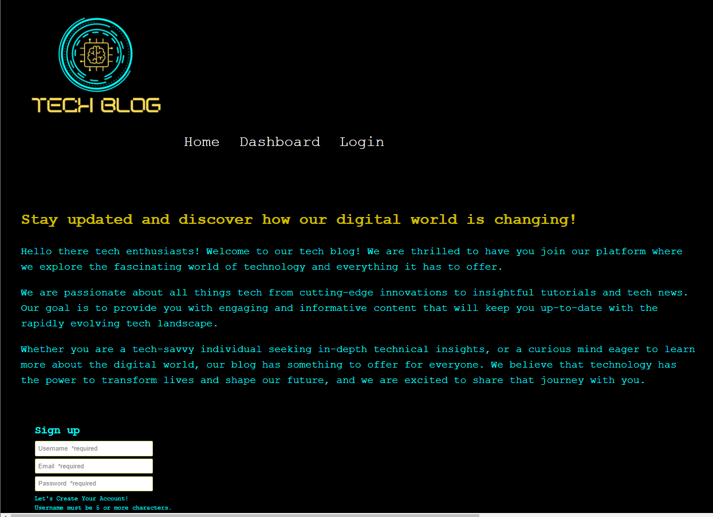

# MVC Tech Blog

 

          
 

 

## Table of Contents

* [Project Description](#project-description)

* [Key Features](#key-features)

* [MockUp](#mockup)
 
* [Links](#links)

* [License](#license)

 

## Project Description

The Blog Post Application is a web-based platform that empowers users to create, publish, and share their thoughts, ideas, and stories with a wide audience. Designed with simplicity in mind, this application allows bloggers, writers, and content creators to express themselves through engaging articles and blog posts.

Whether it's sharing personal experiences, providing insights on specific topics, or showcasing creative works with TechBlog.

## Key Features

User Registration and Authentication: Users can easily create an account and log in securely to access the full range of features, including creating, editing, and managing their blog posts.

Create and Edit Blog Posts: Once logged in, users can compose their blog posts using a user-friendly and intuitive editor. They can add text, images, and formatting to craft compelling and visually appealing content.

Publication and Sharing: With just a click of a button, users can publish their blog posts and make them available to a global audience. The application provides social media integration, enabling easy sharing across various platforms.

User Interaction: Readers can leave comments on blog posts, initiating meaningful conversations with the community.

User Profiles: Each user gets a personalized profile page showcasing their published blog posts and engagement metrics.

 

## Mockup

## Links

Heroku Link:  <a href="https://wr-mvc-tech-blog-e1642ee86913.herokuapp.com/"> MVC TechBlog</a>
 

GitHub Repo Link:   <a href="https://github.com/WHT-RBT/MVC-Tech-Blog.git">GitHub Repo </a>

GitHub Profile Link: <a href="https://github.com/WHT-RBT"> GitHub Profile </a>

 

## License

NOTICE: This application is covered under the MIT License